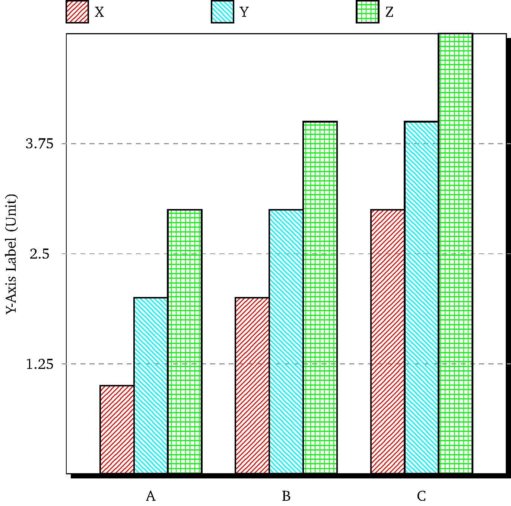

# TiKZ Graphs

Scripts to generate TiKZ code for bar graps and line plots.

## Generating TiKZ code

Generating bar graphs:

```
usage: generate_tikz_bar.py [-h] -d DATA_FILE -o OUTPUT_FILE [--ymin YMIN]
                            [--ymax YMAX] [--ylabel YLABEL] [--xscale XSCALE]
                            [--yscale YSCALE] [--logscale] [--nolegend]

Generates a TiKZ bar plot from an input file.

optional arguments:
  -h, --help            show this help message and exit
  -d DATA_FILE, --data DATA_FILE
                        The input data file.
  -o OUTPUT_FILE, --out OUTPUT_FILE
                        The output TiKZ file.
  --ymin YMIN           Lower limit to y-axis.
  --ymax YMAX           Upper limit to y-axis.
  --ylabel YLABEL       Label for y-axis.
  --xscale XSCALE       Scale for x-axis.
  --yscale YSCALE       Scale for y-axis.
  --logscale, -l        Set logscale for y-axis
  --nolegend            Don't generate a legend.
```

Generating line/scatter plots:

```
usage: generate_tikz_line.py [-h] -d DATA_FILE [DATA_FILE ...] -l LEGEND_ENTRY
                             [LEGEND_ENTRY ...] -o OUTPUT_FILE [--xmin XMIN]
                             [--xmax XMAX] [--ymin YMIN] [--ymax YMAX]
                             [--xlabel XLABEL] [--ylabel YLABEL]
                             [--xscale XSCALE] [--yscale YSCALE] [--logx]
                             [--logy] [--type TYPE]

Generates a TiKZ bar plot from an input file.

optional arguments:
  -h, --help            show this help message and exit
  -d DATA_FILE [DATA_FILE ...], --data DATA_FILE [DATA_FILE ...]
                        The input data files.
  -l LEGEND_ENTRY [LEGEND_ENTRY ...], --legend LEGEND_ENTRY [LEGEND_ENTRY ...]
                        The entries for the legend. Should correspond to the
                        input data files.
  -o OUTPUT_FILE, --out OUTPUT_FILE
                        The output TiKZ file.
  --xmin XMIN           Lower limit to x-axis.
  --xmax XMAX           Upper limit to x-axis.
  --ymin YMIN           Lower limit to y-axis.
  --ymax YMAX           Upper limit to y-axis.
  --xlabel XLABEL       Label for x-axis.
  --ylabel YLABEL       Label for y-axis.
  --xscale XSCALE       Scale for x-axis.
  --yscale YSCALE       Scale for y-axis.
  --logx                Set logscale for x-axis
  --logy                Set logscale for y-axis
  --type TYPE, -t TYPE  Type of plot (scatter/line)
```


## Generating ps, pdf or jpg files

To generate ps, pdf or jpg files, use the `tikz2ps`,`tikz2pdf`, and `tikz2jpg` scripts respectively. Note:

* `tikz2pdf` requires pdflatex.
* `tikz2jpg` requires gs (GhostScript).

## Sample plots

Bar Graph:

